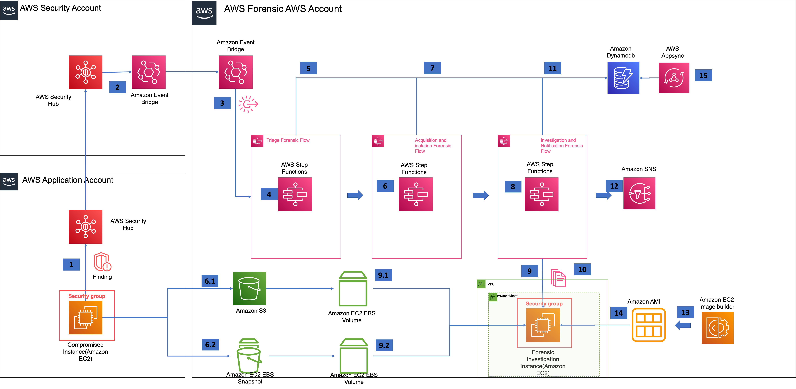

# Automated Forensics Orchestrator for Amazon EC2

Automated Forensics Orchestrator for Amazon EC2 is a self-service AWS Solution implementation that enterprise customers can deploy to quickly set up and configure an automated orchestration workflow that enables their Security Operations Centre (SOC) to capture and examine data from EC2 instances and attached volumes as evidence for forensic analysis, in the event of a potential security breach. It will orchestrate the forensics process from the point at which a threat is first detected, enable isolation of the affected EC2 instances and data volumes, capture memory and disk images to secure storage, and trigger automated actions or tools for investigation and analysis of such artefacts. All the while, the solution will notify and report on its progress, status, and findings. It will enable SOC to continuously discover and analyze patterns of fraudulent activities across multi-account and multi-region environments. The solution will leverage native AWS services and be underpinned by a highly available, resilient, and serverless architecture, security, and operational monitoring features.

Digital forensics is a 4 step process of triaging, acquisition, analysis and reporting. Automated Forensics framework provides capability to enterprise to act on security event by imaging or acquisition of breached resource for examination and generate forensic report about the security breach. In the event of a security breach, it will enable customers to easily to capture and examine required targeted data for forsensic’s storage and analysis. This solution framework enables security operations centre to discover and analyse patterns of fraudulent activities. The automated forensics solution will provide a multi-account and a multi-region [“solution”] built using native AWS services.

### Automated Forensics Orchestrator for Amazon EC2 Solution Architecture



---

## Build and deploy the Forensic stack

### Prerequisites

_Tools_

-   The latest version of the AWS CLI (2.2.37 or newer), installed and configured.
    -   https://aws.amazon.com/cli/
-   The latest version of the AWS CDKV2 (2.2 or newer).
    -   https://docs.aws.amazon.com/cdk/latest/guide/home.html
-   A CDK bootstrapped AWS account.
    -   https://docs.aws.amazon.com/cdk/latest/guide/bootstrapping.html
-   nodejs version 16
    -   https://docs.npmjs.com/getting-started
-   LIME agent installed on EC2
-   Enable SecurityHub as the solution creates a custom action in securityHub
    _Note:_ We are working on a blog detailing how to use SSM Distributor to deploy agents across a multi account environment.
-   Supported EC2 instances
    -   _Amazon Linux 2 AMI (HVM) - Kernel 5.10, SSD Volume Type_ - ami-0a4e637babb7b0a86 (64-bit x86) / ami-0bc96915949503483 (64-bit Arm)

---

### Build and deploy in a new VPC

### Forensic account deployment

1. Clone the solution source code from its GitHub repository.
   `git clone https://github.com/aws-solutions/automated-forensic-orchestrator-for-amazon-ec2.git`
2. Open the terminal and navigate to the folder created in step 1, and then navigate to the source folder
3. Configure your application accounts monitored to establish trust relationship in `cdk.json`
   `"applicationAccounts": ["<<Application account1>>", "<<Application account2>>"],`
4. Set AWS Credentials to deploy into the AWS Account
    - export AWS_ACCESS_KEY_ID=<<XXXXXXXXXXXXXXXX>>
    - export AWS_SECRET_ACCESS_KEY=<<XXXXXXXXXXXXXXXXXXX>>
    - export AWS_SESSION_TOKEN=<<XXXXXXXXXXXXXXXXX>>
    - export AWS_REGION=<<AWS Region - us-east-1>>
5. Run the following commands in the same order as below:
    1. `npm ci`
    2. `npm run build-lambda`
    3. `npm run build:collector`
6. To build the Forensic Stack to be deployed in the Forensic AWS Account:

    `cdk synth -c account=<<Forensic AWS Account>> -c region=<<region>> -c secHubAccount=<<SecuHub Aggregator Account>> -c STACK_BUILD_TARGET_ACCT=forensicAccount` build the necessary CDK CFN templates for deploying forensic stack

    Example:

    `cdk synth -c account=123456789012 -c secHubAccount=123456789012 -c region=us-east-1 -c STACK_BUILD_TARGET_ACCT=forensicAccount`

7. To deploy the Forensic Stack in the Forensic AWS Account:

    `cdk deploy --all -c account=<<Forensic AWS Account>> -c region=<<Forensic Deployment AWS Region>> --require-approval=never -c secHubAccount=<<SecuirtyHub Aggregator AWS Account>>` Deploy the necessary CDK CFN templates for deploying Forensic Solutions stack

    Example:

    `cdk deploy ——all -c secHubAccount=123456789012 -c STACK_BUILD_TARGET_ACCT=forensicAccount -c account=1234567890 -c region=ap-southeast-2 —require-approval=never`

### SecurityHub Aggregator account deployment

To push Forensic findings into a Forensic Account, deploy the following stack in the SecurityHub Aggregator account:

_Note_: If you are reusing the above git clone, delete the `cdk.out` folder.

1. Clone the solution source code from its GitHub repository.
   `git clone https://github.com/aws-solutions/automated-forensic-orchestrator-for-amazon-ec2.git`
2. Open the terminal and navigate to the folder created in step 1, and then navigate to the source folder.
3. Set AWS Credentials to deploy into the AWS Account
    - export AWS_ACCESS_KEY_ID=<<XXXXXXXXXXXXXXXX>>
    - export AWS_SECRET_ACCESS_KEY=<<XXXXXXXXXXXXXXXXXXX>>
    - export AWS_SESSION_TOKEN=<<XXXXXXXXXXXXXXXXX>>
    - export AWS_REGION=<<AWS Region - us-east-1>>
4. Run the following commands in the same order as below:
    1. `npm ci`
    2. `npm run build-lambda`
    3. `npm run build:collector`
5. To build the Forensic Stack to be deployed in the SecurityHub Aggregator account:

    `cdk synth -c sechubaccount=<<SecHub Account>> -c forensicAccount=<<Forensic Account>> -c forensicRegion=<<Forensic Deployment AWS Region>> -c sechubregion=<<SecuirtyHub AWS Region>> -c STACK_BUILD_TARGET_ACCT=securityHubAccount`

    Example:

    `cdk synth -c sechubaccount=0987654321 -c forensicAccount=1234567890 -c forensicRegion=us-east-1 -c sechubregion=us-east-1 -c STACK_BUILD_TARGET_ACCT=securityHubAccount`

6. To deploy the Forensic Stack in the SecurityHub Aggregator account:

    `cdk deploy --all -c account=<<SecuirtyHub AWS Account>> -c region=<<SecuirtyHub AWS Region>> --require-approval=never -c forensicAccount=<<Forensic AWS Account>>` Deploy the necessary CDK CFN templates for deploying SecurityHub stack

    Example:

    `cdk deploy --all -c account=0987654321 -c region=us-east-1 --require-approval=never -c forensicAccount=1234567890` Deploy the necessary CDK CFN templates for deploying SecurityHub stack

### Application account deployment

Deploy the following cloud formation template in Application account to establish a trust relationship between forensic components deployed in the forensic account and the application account.

1. Cloud formation template is available in folder:
   `Aws-compute-forensics-solution/deployment-prerequisties/cross-account-role.yml`
2. Pass the forensic account as input parameter - `solutionInstalledAccount`.

---

## Build and deploy in an existing VPC

### Forensic account deployment

1.  Clone the solution source code from its GitHub repository.
2.  Open the terminal and navigate to the folder created in step 1, and then navigate to the source folder.
3.  Update `cdk.json` to configure `isExistingVPC` to `true` and add `vpcID` to the `vpcConfigDetails` section.

        "vpcConfigDetails": {
            "isExistingVPC": true,
            "vpcID": "vpc-1234567890"
            "enableVPCEndpoints": false,
            "enableVpcFlowLog": false
        }

4.  Configure your application accounts monitored to establish trust relationship in cdk.json
    `"applicationAccounts": ["<<Application account1>>", "<<Application account2>>"],`
5.  Set AWS Credentials to deploy into the AWS Account
    -   export AWS_ACCESS_KEY_ID=<<XXXXXXXXXXXXXXXX>>
    -   export AWS_SECRET_ACCESS_KEY=<<XXXXXXXXXXXXXXXXXXX>>
    -   export AWS_SESSION_TOKEN=<<XXXXXXXXXXXXXXXXX>>
    -   export AWS_REGION=<<AWS Region - us-east-1>>
6.  Run the following commands in the same order as below:
    1. `npm ci`
    2. `npm run build-lambda`
    3. `npm run build:collector`
7.  To build the Forensic Stack to be deployed in the Forensic AWS Account:

    `cdk synth -c account=<<Forensic AWS Account>> -c region=<<Forensic Deployment AWS Region>> -c secHubAccount=<<SecuHub Aggregator Account>> -c STACK_BUILD_TARGET_ACCT=forensicAccount` build the necessary CDK CFN templates for deploying forensic stack

    Example:

    `cdk synth -c account=1234567890 -c secHubAccount=0987654321 -c region=us-east-1 -c STACK_BUILD_TARGET_ACCT=forensicAccount`

8.  To deploy the Forensic Stack in the Forensic AWS Account:

    `cdk deploy --all -c account=<<Forensic AWS Account>> -c region=<<Forensic Deployment AWS Region>> --require-approval=never -c secHubAccount=<<SecuirtyHub Aggregator AWS Account>>` Deploy the necessary CDK CFN templates for deploying Forensic Solutions stack

    Example:

    `cdk deploy —all -c secHubAccount=0987654321 -c STACK_BUILD_TARGET_ACCT=forensicAccount -c account=1234567890 -c region=ap-southeast-2 —require-approval=never`

### SecurityHub Aggregator account deployment

To push Forensic findings into a Forensic Account, deploy the following stack in SecurityHub Aggregator account.

_Note_: If you are reusing the above git clone, delete the `cdk.out` folder.

1.  Clone the solution source code from its GitHub repository.
2.  Open the terminal and navigate to the folder created in step 1, and then navigate to the source folder.
3.  Update `cdk.json` to configure `isExistingVPC` to `true` and add `vpcID` to the `vpcConfigDetails` section.

        "vpcConfigDetails": {
            "isExistingVPC": true,
            "vpcID": "vpc-1234567890"
            "enableVPCEndpoints": false,
            "enableVpcFlowLog": false
        }

4.  Set AWS Credentials to deploy into the AWS Account
    -   export AWS_ACCESS_KEY_ID=<<XXXXXXXXXXXXXXXX>>
    -   export AWS_SECRET_ACCESS_KEY=<<XXXXXXXXXXXXXXXXXXX>>
    -   export AWS_SESSION_TOKEN=<<XXXXXXXXXXXXXXXXX>>
    -   export AWS_REGION=<<AWS Region - us-east-1>>
5.  Run the following commands in the same order as below:
    1. `npm ci`
    2. `npm run build-lambda`
    3. `npm run build:collector`
6.  To build the Forensic Stack to be deployed in SecurityHub Aggregator account:

    `cdk synth -c sechubaccount=<<SecHub Account>> -c forensicAccount=<<Forensic Account>> -c forensicRegion=<<Forensic Deployment AWS Region>> -c sechubregion=<<Security Hub Region>> -c STACK_BUILD_TARGET_ACCT=securityHubAccount`

    Example:

    `cdk synth -c sechubaccount=0987654321 -c forensicAccount=1234567890 -c forensicRegion=ap-southeast-2 -c sechubregion=ap-southeast-2 -c STACK_BUILD_TARGET_ACCT=securityHubAccount`

7.  To deploy the Forensic Stack loyed in SecurityHub Aggregator account:

    `cdk deploy --all -c account=<<SecuirtyHub AWS Account>> -c region=<<Security Hub Region>> --require-approval=never -c forensicAccount=<<Forensic AWS Account>>` Deploy the necessary CDK CFN templates for deploying SecurityHub stack

    Example:

    `cdk deploy --all -c account=0987654321 -c region=ap-southeast-2 --require-approval=never -c forensicAccount=1234567890` Deploy the necessary CDK CFN templates for deploying SecurityHub stack

### Application account deployment

Deploy the following cloud formation template in Application account to establish a trust relationship between forensic components deployed in the Forensic account and the Application account.

1. Cloud formation template is available in folder
   `Aws-compute-forensics-solution/deployment-prerequisties/cross-account-role.yml`
2. Pass the forensic account as input parameter - `solutionInstalledAccount`.

## Uninstall the solution

To uninstall the solution, you can either:

-   Run `cdk destroy --all` from the source folder, or
-   Delete the stack from the CloudFormation console. To delete using the AWS Management Console:
    1. Sign in to the AWS CloudFormation console.
    2. Select this solution’s installation stack.
    3. Choose _Delete_.

---

## Initialize the Repository

After successfully cloning the repository into your local development environment, you will see the following file structure in your editor:

```
|- .github/ ...               - resources for open-source contributions.
|- source/                    - all source code, scripts, tests, etc.
  |- bin/
    |- forensic-cdk-solution.ts - the CDK app that wraps your solution for building forensic stacks
  |- deployment-prerequisties - Cross account stack deployment to trust forensic stack
  |- lambda/                  - Contains lambda python code
  |- lib/
    |- forensic-solution-builder-stack.ts  - the main CDK stack for your solution.
  |- cdk.json                 - config file for CDK.
  |- jest.config.js           - config file for unit tests.
  |- package.json             - package file for the CDK project.
  |- README.md                - doc file for the CDK project.
  |- run-all-tests.sh         - runs all tests within the /source folder. Referenced in the buildspec and build scripts.
|- .gitignore
|- CHANGELOG.md               - required for every solution to include changes based on version to auto-build release notes.
|- CODE_OF_CONDUCT.md         - standardized open source file for all solutions.
|- CONTRIBUTING.md            - standardized open source file for all solutions.
|- LICENSE.txt                - required open source file for all solutions - should contain the Apache 2.0 license.
|- NOTICE.txt                 - required open source file for all solutions - should contain references to all 3rd party libraries.
|- README.md                  - required file for all solutions.
```

---

## Build your Forensic Orchestrator CDK project

Once you have initialized the repository, you can make changes to the code. As you work through the development process, the following commands may be useful for periodic testing and/or formal testing once development is completed. These commands are CDK-related and should be run at the /source level of your project.

CDK commands:

-   `cdk init` - creates a new, empty CDK project that can be used with your AWS account.
-   `cdk synth` - synthesizes and prints the CloudFormation template generated from your CDK project to the CLI.
-   `cdk deploy` - deploys your CDK project into your AWS account. Useful for validating a full build run as well as performing functional/integration testing
    of the solution architecture.

Additional scripts related to building, testing, and cleaning-up assets may be found in the `package.json` file or in similar locations for your selected CDK language. You can also run `cdk -h` in the terminal for details on additional commands.

---

## Run Unit Tests

### Prerequisites

Python version 3.8.x. We recommend setting up [pyenv](https://github.com/pyenv/pyenv).

### Tests for Python code of the lambdas

-   `make help` lists all the command
-   `make virtualenv` creates a Python virtualenv for development
-   `source .venv/bin/activate` activates the virtual environment
-   `make test` runs the test (includes format, lint and static check)
-   `make fmt` only runs format
-   `make lint` only runs lint
-   `make install` installs all dependency
-   `make lock-version` locks the version if there is any latest version dependency (e.g no version specified)
-   `make check-py-version` a prerequisite for build execution, is relied upon by tasks `test` and `virtualenv`

The `/source/run-all-tests.sh` script is the centralized script for running all unit, integration, and snapshot tests for both the CDK project as well as any associated Lambda functions or other source code packages.

_Note_: It is the developer's responsibility to ensure that all test commands are called in this script, and that it is kept up to date.

This script is called from the solution build scripts to ensure that specified tests are passing while performing build, validation and publishing tasks via the pipeline.

---

## Collection of operational metrics

This solution collects anonymous operational metrics to help AWS improve the quality and features of the solution. For more information, including how to disable this capability, please see the [implementation guide](https://docs.aws.amazon.com/solutions/latest/automated-forensics-orchestrator-for-amazon-ec2/collection-of-operational-metrics.html).

## Useful commands

-   `npm run all` Builds all necessary components
-   `cdk deploy ForensicSolutionStack` Deploys VPC and Forensic Stack in forensic account
-   `cdk deploy ForensicImageBuilderStack` Builds and deploys Image builder pipeline
-   `npm run all` Builds all necessary components
-   `npm run watch` Watches for changes and compile
-   `npm run test` Performs the jest unit tests
-   `cdk diff` Compares deployed stack with current state
-   `cdk synth` Emits the synthesized CloudFormation template
-   Steps to build the Forensic Stack to be deployed in Forensic AWS Account
    -   `export STACK_BUILD_TARGET_ACCT=forensicAccount` - Sets the environment variable as forensic Account to build the necessary CDK CFN templates for deploying forensic stack
    -   `cdk synth -c account=<<Forensic AWS Account>> -c region=<<Forensic AWS Region>>` build the necessary CDK CFN templates for deploying forensic stack
-   Steps to build the Forensic Stack to be deployed in SecurityHub AWS Account
    -   `export STACK_BUILD_TARGET_ACCT=securityHubAccount` - Sets the environment variable as SecurityHubAccount Account to build the necessary CDK CFN templates for deploying SecurityHub stack
    -   `cdk synth -c account=<<SecuirtyHub AWS Account>> -c region=<<Security Hub Region>>` Build the necessary CDK CFN templates for deploying SecurityHub stack
-   Steps to deploy the Forensic Stack in Forensic AWS Account
    -   `export STACK_BUILD_TARGET_ACCT=forensicAccount` - Sets the environment variable as forensic Account to build the necessary CDK CFN templates for deploying forensic stack
    -   `cdk deploy --all -c account=<<Forensic AWS Account>> -c region=<<Forensic AWS Region>> --require-approval=never -c secHubAccount=<<SecuirtyHub AWS Account>>` Deploy the necessary CDK CFN templates for deploying Forensic Solutions stack
-   Steps to deploy the Forensic Stack in SecurityHub AWS Account
    -   `export STACK_BUILD_TARGET_ACCT=securityHubAccount` - Sets the environment variable as SecurityHubAccount Account to build the necessary CDK CFN templates for deploying SecurityHub stack
    -   `cdk deploy --all -c account=<<SecuirtyHub AWS Account>> -c region=<<Security Hub Region>> --require-approval=never -c forensicAccount=<<Forensic AWS Account>>` Deploy the necessary CDK CFN templates for deploying SecurityHub stack

---
```
Note: 
We make no claim as to the suitability of Automated Forensics Orchestrator for Amazon EC2 in the detection or investigation of crime, nor the ability of data or forensics evidence captured by this solution to be used in a court of law. You should independently evaluate the suitability of Automated Forensics Orchestrator for Amazon EC2 for your use case.

```

---

Copyright Amazon.com, Inc. or its affiliates. All Rights Reserved.

Licensed under the Apache License Version 2.0 (the "License"). You may not use this file except in compliance with the License. A copy of the License is located at

    http://www.apache.org/licenses/

or in the "license" file accompanying this file. This file is distributed on an "AS IS" BASIS, WITHOUT WARRANTIES OR CONDITIONS OF ANY KIND, express or implied. See the License for the specific language governing permissions and limitations under the License.
