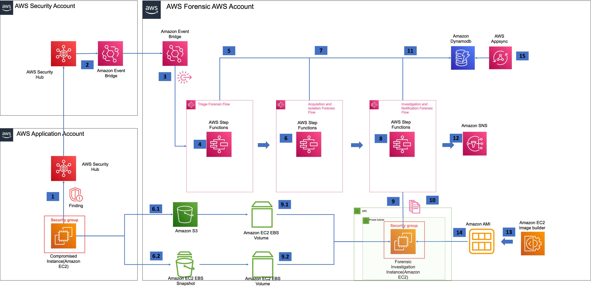

# Automated Forensics Orchestrator for Amazon EC2 and EKS

AWS EC2 and EKS Forensics Orchestrator is a self-service Guidance implementation that enterprise customers can deploy to quickly set up and configure an automated orchestration workflow. The workflow enables the Security Operations Centre (SOC) to capture and examine data from EC2 instances or EKS Clusters, and attached volumes as evidence for forensic analysis, in the event of a potential security breach. Currently, the Guidance only supports EKS Clusters hosted on EC2 instances. Learn more about the differences for responding to EC2 and EKS security events [here](https://aws.amazon.com/blogs/security/how-to-automate-incident-response-for-amazon-eks-on-amazon-ec2/)

The Guidance orchestrates the forensics process from the point at which a threat is first detected, enable isolation of the affected EC2 instances, EKS clusters, data volumes, capture memory and disk images to secure storage, and trigger automated actions or tools for investigation and analysis of such artefacts. The Guidance notifies and reports on its progress, status, and findings, which enables SOCs to continuously discover and analyze patterns of fraudulent activities across multi-account and multi-region environments. The Guidance leverages native AWS services and is underpinned by a highly available, resilient, and serverless architecture, security, and operational monitoring features.

Digital forensics is a four step process of triaging, acquisition, analysis and reporting. The automated Forensics framework provides enterprises the capability to act on a security event by imaging or acquisition of breached resource for examination and generates a forensic report about the security breach. In the event of a security breach, it enable customers to easily to capture and examine required targeted data for forsensic’s storage and analysis.

A full walkthrough for the Guidance can be found [here](https://docs.aws.amazon.com/solutions/latest/automated-forensics-orchestrator-for-amazon-ec2/welcome.html)

### EC2 & EKS Forensic Orchestrator Guidance Architecture



---
### Cost

As of the recent revision, the monthly cost for running this Guidance with the default settings in the US East (N. Virginia) AWS Region is approximately $235 assuming an average of one forensic instance is 50% utilized for performing forensic analysis with 512GB of volume attached to the instance. Prices are subject to change. For full details, refer to the pricing page for each AWS service used in this Guidance.

The total cost to run this Guidance depends on the following factors:
-   The number of forensic incidents reported
-   The frequency of forensic orchestration
-   The Guidance assumes a forensic instance runs 12 hours a day

This Guidance uses the following AWS components, which incur a cost based on your configuration.  

| **AWS service**   | Dimensions                                             | Monthly cost \[USD\] |
| ----------------- | ------------------------------------------------------ | ---------------------------------------------- |
| AWS Step Functions | Workflow requests (10 per day), State transitions per workflow (20) | $1 |
| Amazon CloudWatch |  Number of Metrics (includes detailed and custom metrics) (20), Number of Custom/Cross-account events (100,000) Number of Dashboards (1), Number of Standard Resolution Alarm Metrics (20), Number of High-Resolution Alarm Metrics (20), Number of Canary runs (5), Number of Lambda functions (10), Number of requests per function (5 per day), Number of Contributor Insights rules for DynamoDB (5) Total number of events for DynamoDB (1 million events per month), Total number of matched log events for CloudWatch (1 million matched log events per month), Number of Contributor Insights rules for CloudWatch (5) Standard Logs: Data Ingested (1 GB), Logs Delivered to S3: Data Ingested (1 GB)  | $47 |
| Amazon DynamoDB | Average item size (all attributes) (20 KB), Data storage size (0.5 GB) | $26 |
| Amazon Simple Notification Service (SNS) |  DT Inbound: Not selected (0 TB per month), DT Outbound: Not selected (0 TB per month), Requests (100,000 per month), HTTP/HTTPS Notifications (100,000 per month) EMAIL/EMAIL-JSON Notifications (100,000 per month) SQS Notifications (100,000 per month), AWS Lambda (1 million per month) | $2 |
| Amazon Elastic Compute Cloud(EC2) * |  Operating system (Linux), Quantity (1), Pricing strategy (On-Demand Instances), Storage amount (100 GB), Instance type (M5.2Xlarge) - OnDemand based on the forensic analysis performed – the analysis host runs the Amazon Linux 2023 forensic analysis AMI built by `ForensicImageBuilderStack` | $142 |
| AWS Lambda | 10,000 requests, 60 seconds per lambda function, 512MB of Memory | $10 |
| AWS KMS Key | 1 KMS key, 1,990,000 requests (2,010,000 total requests - 20,000 free tier requests) x $0.03 / 10,000 requests | $7 |
| EC2 Image Builder | The service itself is free. One monthly rebuild of the forensic analysis AMI: a `t3.large` build instance and a `t3.large` test instance for roughly 25 minutes each, plus one 30 GiB EBS snapshot retained per AMI version | <$1 |
| | **Total** | ~$235 USD/ month |

 *average usage cost of Amazon EC2 

## Build and deploy the Forensic stack

### Prerequisites

_Tools_

-   The latest version of the AWS CLI (2.2.37 or newer), installed and configured.
    -   https://aws.amazon.com/cli/
-   The latest version of the AWS CDKV2 (2.2 or newer).
    -   https://docs.aws.amazon.com/cdk/latest/guide/home.html
-   Forensic and Security Hub AWS accounts are bootstrapped with CDK bootstrapped
    -   https://docs.aws.amazon.com/cdk/latest/guide/bootstrapping.html
-   nodejs version 20
    -   https://docs.npmjs.com/getting-started
-   Ensure GraphQL – AppSync is activated in the Forensic AWS account
-   AWS Systems Manager (SSM) [agent](https://docs.aws.amazon.com/systems-manager/latest/userguide/ssm-agent.html) installed on EC2 or EKS cluster
-   Enable SecurityHub to allow creation of a custom action in securityHub
    _Note:_ We are working on a blog detailing how to use SSM Distributor to deploy agents across a multi account environment.
-   Supported operating systems on the EC2 instances being investigated

    Disk acquisition is snapshot-based and therefore operating-system agnostic. Triage and
    isolation are API-driven and equally agnostic. Only **memory** forensics is coupled to the
    guest OS, because it needs a Volatility 3 symbol table built for the target's exact kernel
    release (`uname -r`), and because acquisition itself is guest-specific. Linux acquisition
    tries two independent mechanisms — LiME, a kernel module, and AVML, which reads
    `/dev/crash`, `/dev/mem` or `/proc/kcore` — and moves to the second only if the first
    produces a capture with no kernel banner in it. See
    [Memory acquisition mechanisms](#memory-acquisition-mechanisms) below.

    | Operating system | Memory acquisition | Memory analysis |
    | --- | --- | --- |
    | Amazon Linux 2023, kernel 6.18 | Supported — verified end to end | Supported — verified end to end. Build the symbol table with the `Forensic-Profile-Function` state machine, `distribution: AL2023` |
    | Amazon Linux 2023, kernel 6.1 | Supported — verified end to end on `al2023-ami-kernel-6.1-x86_64` (6.1.180) | Supported — verified end to end on the same instance; Volatility 3 2.28.2 walked the process list with creation timestamps. See the empty-capture note below: two earlier attempts on this kernel line produced unusable captures, and the cause has not been isolated — it is not the kernel and not the instance's uptime |
    | Amazon Linux 2023, kernel 6.12 | Not verified | Not verified |
    | Amazon Linux 2 (kernel 4.14 default, 5.10 via `amazon-linux-extras`) | Supported — verified end to end on kernel 4.14.355. LiME is compiled in the guest when no pre-built module is staged, and the published digest matched the digest recomputed from the stored capture | Supported — `Forensic-Profile-Function` with `distribution: AL2`, new in 2.0.0 and verified on a live AL2 instance producing a 25 MB, 102,393-symbol table for kernel 4.14.355. Previously unreachable: the handler derived the document's environment variable by concatenating the distribution string, and AL2's document is `amazon-linux-2-volatility-profile.json`, so the CDK names its variable `AMAZON_LINUX_2_VOLATILITY_PROFILE` — a name `"AL2"` cannot produce. AL2 reached end of life on 30 June 2026 — migrate rather than build on this |
    | Red Hat Enterprise Linux **8 only** | Supported — verified end to end on RHEL 8.10, acquired with AVML. **7 and 9 are not supported despite what earlier revisions of this table said.** Only `RHEL8_LIME_MEMORY_ACQUISITION` is wired, so a RHEL 7 or RHEL 9 target now fails saying that release is unsupported and that no document is deployed for it — it previously raised `KeyError: 'RHEL9_LIME_MEMORY_ACQUISITION'`. A version of exactly `8.0` used to fail differently again, because the version tests were strict inequalities (`9 > 8.0 > 8` is false) so no branch assigned the variable; worse, in a finding with a RHEL 9 instance ahead of it, the RHEL 8.0 instance inherited `9` and both failed. Fixed in 2.0.0 | Requires a Red Hat subscription for `kernel-debuginfo`; see [Build RHEL kernel symbol](#build-rhel-kernel-symbol-for-memory-analytics-support-of-red-hat-enterprise-linux-8). Not verified here, because no subscription was available. `Forensic-Profile-Function` accepts `RHEL8` only — earlier releases also accepted `RHEL7` and `RHEL9`, but no document or environment variable was ever wired for them, so those values passed validation and then raised `KeyError` |
    | Windows Server 2016 / 2019 | Supported — verified end to end on Server 2019 (build 17763) | Supported — verified end to end on Server 2019. No symbol table build is needed: Volatility 3 resolves Windows kernel symbols by downloading the matching PDB from Microsoft's symbol server at analysis time, so the analysis host needs egress to `msdl.microsoft.com` |
    | Windows Server 2022 and later | **Not supported.** The pinned `winpmem_mini_x64_rc2.exe` reports itself as version 2.0.1 (October 2020); on Server 2022 its driver extracts, unloads immediately and exits without writing anything, leaving a zero byte capture. The acquisition document detects this and fails rather than uploading an empty image as evidence. Acquire disk instead, or supply a memory imager that supports the build | n/a |
    | Ubuntu and other Debian derivatives | Supported | Supported once a symbol table exists for the target kernel |

    A symbol table is specific to one kernel release, not to a distribution. Generate one for
    every distinct kernel in the estate, and again whenever patching changes `uname -r`.
    Migrate away from Amazon Linux 2: it no longer receives security updates.

    **LiME intermittently returns an unusable capture, on any distribution or kernel.** As of
    2.0.0 acquisition detects this and re-acquires with AVML, but check that a memory
    acquisition produced analysable evidence before closing the case regardless: the check is a
    kernel banner in the stream, which is a strong signal and not a proof of completeness. The
    image is full size and its header is valid, but its pages are almost entirely zero and it
    contains no kernel banner, so Volatility 3 cannot identify the kernel and every plugin
    fails. Measured on two such captures: 2.08 GiB of which 47,349,114 bytes (2.3%) were
    non-zero, and 2.10 GiB of which 6,554,097 bytes (0.31%) were non-zero — in both cases real
    content confined to roughly the first 64 MB and nothing but zeros when sampled at
    20/40/60/80% of the file. Compressed size is the quickest tell: a good 2 GiB capture came to
    517 MB gzipped, a bad one to 8.5 MB.

    Three of nine acquisitions observed here were unusable, across both Amazon Linux 2
    (kernel 4.14) and Amazon Linux 2023 (kernels 6.1 and 6.18), and the cause has not been
    isolated. Uptime is not it: an AL2023 and an AL2 instance launched three seconds apart and
    acquired in the same second, both t3.small in the same subnet, produced a good capture and
    an empty one respectively at 3.6 and 3.5 minutes of uptime. Re-acquiring is the remedy, and
    it has succeeded on a kernel that had just failed twice.

    As of 2.0.0 the acquisition document catches this itself and re-acquires with the other
    mechanism. Previously its only gate was a 65,536 byte floor on the upload, which a
    99.7%-NUL capture passes easily — one synthetic reproduction landed at 67,232 bytes, i.e.
    it cleared the floor by 1,696 bytes — so acquisition reported success and the problem
    surfaced later, in the investigation, on a different host and possibly after the instance
    was gone. The investigation still performs its own check and still says which of the two
    problems it is — an unusable capture, or a missing symbol table — because one is fixed by
    re-acquiring and the other by building an ISF. Disk acquisition of the same instance is
    unaffected.

    #### Memory acquisition mechanisms

    Linux memory is acquired by whichever of two independent tools produces a readable capture
    first. `memoryAcquisitionTools` in `cdk.json` sets which are tried and in what order;
    the default is `lime,avml`.

    | | LiME | AVML |
    | --- | --- | --- |
    | Mechanism | kernel module mapping physical ranges | reads `/dev/crash`, `/dev/mem` or `/proc/kcore`, in that order |
    | Needs a compiler or headers on the target | yes, unless a `.ko` for that exact kernel release is staged under `tools/LiME/` | no |
    | Pinned at | tag `v1.12.0`, `jtsylve/LiME` | release `v0.20.0`, verified by SHA256 before it is made executable |
    | Direction | listens on `127.0.0.1:4444`; the document connects to it | connects outward to a listener the document starts |
    | Output format | LiME | LiME (its default) |
    | Architectures | x86_64 | x86_64 and `aarch64` |
    | Image size, 8 GiB host | 8,418,013,312 bytes | 1,690,352,828 bytes |
    | Architectures | x86_64 only (a module must be compiled per kernel) | x86_64 and `aarch64`, selected by `uname -m` |

    #### Evidence coverage, measured

    The size difference above invites the question of whether AVML loses evidence. It was tested
    by planting artifacts with known contents in known memory regions and asking whether each
    tool's capture contains them — a miss is then unambiguous, which a comparison of plugin
    output between two captures of a live host is not. On both an `m6i.large` (x86_64) and an
    `m7g.large` (Graviton, kernel 6.18.41 aarch64):

    | Planted in | LiME | AVML |
    | --- | --- | --- |
    | Process heap | found | found |
    | Process stack | found | found |
    | Process `argv` | found | found |
    | Process `environ` | found | found |
    | A file unlinked while still open | found | found |
    | tmpfs / page cache | found | found |

    **6 of 6 in every capture, on both architectures.** The occurrence counts differ between
    tools (`environ` 50 against 34 on x86_64) because the captures were taken minutes apart on a
    live host and duplicate copies in page cache come and go; what matters for evidence is that
    no category is absent from either.

    What this does *not* establish, and should not be read as establishing:

    -   **Neither tool produces an atomic image.** A capture takes 66–197 s on the sizes tested
        while the system keeps running, so the image is a smear: individual pages are authentic
        but pointers between structures can be mutually inconsistent. That is inherent to live
        acquisition, not specific to either tool.
    -   **AVML's coverage is the kernel direct map, not every physical range.** On Amazon Linux
        2023 neither `/dev/crash` nor `/dev/mem` exists, so AVML reads `/proc/kcore`. That covers
        System RAM — which is what the results above show — but not reserved or device ranges
        that LiME's physical-range enumeration does include. Those are rarely evidentiary; an
        examiner reconstructing hardware state should prefer LiME.
    -   Swap, full-disk-encryption key material outside RAM, and hypervisor-level memory are out
        of scope for both.

    **The size difference is sparseness, not lost evidence.** Neither `/dev/crash` nor
    `/dev/mem` exists on Amazon Linux 2023, so AVML reads `/proc/kcore` and writes only mapped
    ranges; LiME writes every physical range including free pages. Compressed, the two are
    within 4% of each other (619 MB against 598 MB), which is the tell — LiME's extra 6.7 GiB
    is almost entirely zeros. Volatility 3 finds the kernel banner at the *same* offsets in
    both, above the 4 GiB boundary, and the plugins that have to read **user-space** pages
    recover comparable results: `linux.psaux` 124 processes against 121, both with full argv
    strings read from the user stack, `linux.envars` 476 against 447, `linux.lsof` 1788 against
    1741, `linux.proc.Maps` 4343 against 3750. Those residual gaps are the same order as the
    process-list drift between two captures of a live host a minute apart, so the comparison
    cannot separate the last few percent from that drift.

    Neither writes anything to the disk of the machine under investigation: both stream, and
    the capture goes straight to S3. Because both write LiME format, Volatility 3 reads either
    through the same layer and nothing downstream needs to know which one ran. Which one *did*
    run is recorded on the S3 object as `acquisition-tool`, `acquisition-tool-version`,
    `acquisition-tool-origin` and `acquisition-attempt` metadata.

    A capture is rejected — and the next tool tried — when the upload is under 65,536 bytes or
    when the stream contained no kernel banner. A rejected capture is never deleted; it stays
    as a previous version of the object, so an examiner can look at what was rejected. If no
    tool produces a readable capture, the step fails and says what each tool did rather than
    reporting success.

    To stage either tool for hosts with no route to GitHub, put the AVML binary at
    `s3://<forensic bucket>/tools/avml/avml` and per-kernel LiME modules at
    `s3://<forensic bucket>/tools/LiME/lime-<uname -r>.ko`. A staged binary is used as-is: its
    provenance is yours, not the upstream project's. Staging also removes the only step that
    needs egress beyond S3 and Systems Manager — note that isolation runs *after* acquisition,
    so an instance still has its normal network path while being imaged.

    Two operational points follow from having two attempts instead of one:

    -   **`ssmExecutionTimeout` is a budget for the whole step, not for one capture.** The
        document refuses to start an attempt it cannot finish, estimating from the previous
        attempt's own duration, and says so rather than being killed mid-stream — a kill there
        would leave neither a capture nor a reason. If you see
        `not starting <tool>: Ns of the Ms step budget remain`, raise `ssmExecutionTimeout`.
        The default 1800 s is comfortable for the instance sizes tested here; a large-memory
        target streaming through a single-threaded `gzip` needs more.
    -   **The document does not assume much about the target.** The AVML listener resolves
        `python3`, then `python2`, then `python`, because the `amazonlinux:2` container image
        ships only python2.7 even though the stock AL2 AMI ships both. The AVML binary is
        relocated to `/var/tmp` or `/run` if its working directory is mounted `noexec`, which
        CIS hardening does to `/tmp`. In both cases the alternative was losing the second
        mechanism silently on the hosts most likely to need it.

    The investigation reports the acquiring tool in its own output, next to the kernel it
    already reported — labelled as reported by the acquiring host, not independently verified,
    because that metadata was written on the machine under investigation using credentials that
    machine held. It corroborates provenance; it is not proof, and nothing branches on it.

    #### What the paired trial measured

    36 live acquisitions, six per tool on each of three hosts — AL2023 kernel 6.1.180, AL2023
    kernel 6.18.41, AL2 kernel 4.14.355 — interleaved on the same instances so host drift hit
    both tools equally.

    | | LiME | AVML |
    | --- | --- | --- |
    | Usable captures | 18/18 | 18/18 |
    | Wall clock for ~1.9 GiB (min / median / max) | 64 / 80 / 98 s | 64 / 66 / 82 s |
    | Volatility 3 `banners.Banners` | kernel found | kernel found, **same three offsets** |
    | `linux.pslist` on the AL2 host | 104 processes | 101 processes, 85 shared |

    Read this carefully, because it is easy to over-claim from it:

    -   **The intermittent LiME failure did not reproduce.** Zero unusable captures in 18 runs,
        on the same kernel lines where 3 of 9 had failed earlier. The failure is real and
        remains unexplained; this trial simply did not provoke it. **Nothing here shows AVML to
        be more reliable than LiME.** The fallback is insurance against a failure that has been
        observed, not a fix for a measured rate — which is also why the default order did not
        change.
    -   **The two tools are analytically equivalent but not byte-identical.** On a host
        reporting 1.893 GiB, LiME wrote 2,107,145,280 bytes and AVML 1,855,487,487, because they
        enumerate physical ranges differently and LiME includes ranges beyond usable RAM. The
        LiME format carries range headers, so addressing is preserved — which is what identical
        banner offsets in both images demonstrates. The `pslist` differences are all transient
        high PIDs, consistent with two captures of a live host a minute apart.
    -   **AVML was consistently faster** and needs no kernel module, no compiler and no
        `kernel-devel`. On the AL2 host LiME had to compile its module in the guest from the
        pinned tag, which is the slowest path and the one with the most to go wrong.
    -   **Instances whose memory spans the 4 GiB boundary behave the same.** Every host in the
        36-run trial was a t3.small, with one contiguous System RAM range below 4 GiB — and a
        partial-capture bug that only appears with several ranges is the shape of "full-size
        image, almost all zeros". An 8 GiB and a 32 GiB host, each with four System RAM ranges
        including one above 4 GiB, were captured by both tools: four for four usable. That
        hypothesis is not supported either, and the failure remains unexplained.
    -   **A 30.8 GiB host took LiME 197 s and AVML 88 s**, so two attempts fit inside the
        default 1800 s `ssmExecutionTimeout` with room to spare. That was a freshly booted host
        whose free pages compress away; a host with mostly non-zero memory takes proportionally
        longer through a single-threaded `gzip`, which is what the budget guard exists for.

    Provenance was recorded correctly on all 36 objects and distinguished every resolution path:
    `staged` for pre-built LiME modules, `built-from-v1.12.0` where the pinned clone was
    compiled in the guest, and `release-v0.20.0` for all 18 AVML runs — each of which downloaded
    the real binary from GitHub and verified it against the pinned digest. Integrity was
    confirmed by recomputing the digest from the stored objects.

    #### Permissions this solution holds deliberately

    A security review of 2.0.0 flagged four broad grants. Each is a functional requirement of
    incident response rather than an oversight, each is now justified at the statement that
    grants it, and each carries the residual risk below. They are recorded here so that an
    operator can decide whether to accept them, not buried in a suppression list.

    | Grant | Why it cannot be narrowed | Residual risk |
    | --- | --- | --- |
    | `iam:PutRolePolicy` on `role/*` | Isolation attaches a deny-all inline policy to the instance profile role of whichever instance turns out to be compromised. That role is unknown at deploy time and IAM has no condition key for an inline policy name. | A principal that can invoke the isolation Lambda, or assume the cross-account role, can write an inline policy onto any role in that account. **Restrict who may do either, and alert on `iam:PutRolePolicy` in CloudTrail.** |
    | `ssm:SendCommand` on any instance | Which instance is under investigation is not known until a finding arrives. | Bounded by scoping the *document* half to the forensic account's documents, so the role can run only forensic documents — not `AWS-RunShellScript`. |
    | All-port ingress from `0.0.0.0/0` on the isolation security group | Matching *all* traffic is what converts an instance's existing flows from tracked to untracked, so isolation drops an attacker's established session instead of leaving it open. Narrowing the CIDR defeats the mechanism. | A brief window, on an instance already believed compromised, before the no-rule group replaces it. |
    | `ec2:RunInstances` / `ec2:CreateTags` on `*` | The analysis host's AMI, subnet and security group are resolved at investigation time from SSM parameters and VPC lookups. | `RunInstances` is conditioned on the region. A compromised orchestrator could launch instances in that region. |

    Removing any of the first three removes a containment or collection step, not just a
    permission. The remaining review findings were fixed rather than accepted: credentials are
    no longer logged, every upstream tool is pinned, and the supply-chain and data-handling
    items are closed.

    **Using an existing VPC requires tagging the subnet you want forensic instances to use.**
    Set `aws-cdk:subnet-name` to `service` on it. When this solution builds its own VPC the tag
    is applied automatically; with `isExistingVPC` the VPC is resolved through `Vpc.fromLookup`
    and your subnets were not created by this app, so nothing tags them. Until 2.0.0 the three
    workflows that launch an instance — the analysis host, the symbol builder and the
    deploy-time tools loader — failed with `IndexError: list index out of range` in that case.
    They now name the VPC, the tag and the value.

    **The cross-account prerequisite is required even for a single-account deployment.** Every
    Lambda reaches the instance under investigation by assuming
    `ForensicEc2AllowAccessRole-<region>`, including when the forensic account *is* the
    application account: `create_aws_client` has a same-account fast path but it is gated on
    `not app_account_role`, and the CDK always sets `APP_ACCOUNT_ROLE`, so the branch is
    unreachable. Without that role, triage fails on its first call with
    `AccessDenied ... not authorized to perform: sts:AssumeRole`. Deploy
    `deployment-prerequisties/cross-account-role.yml` into the forensic account too, and
    override both defaults — `solutionAccountRegion` defaults to `us-west-2` and `kmsKey` to a
    placeholder ARN. Leaving the region default produces a trust policy naming
    `triage-us-west-2-Role` and the stack rolls back with `Invalid principal in policy`, which
    does not name the parameter at fault.

    **Isolation does not swap the instance profile in a single-account deployment.** For a
    same-account finding, `isolateEc2` selects the solution account's own
    `ForensicIsolationInstanceProfile-<region>`, but the call is still made through the assumed
    `ForensicEc2AllowAccessRole`, whose `iam:PassRole` is scoped to the `IAMIsolationIAMRole`
    that the prerequisite template creates. `ReplaceIamInstanceProfileAssociation` therefore
    fails with `UnauthorizedOperation`, and the code logs it as a "non critical failure" and
    proceeds, so the isolation still reports success. Verified by policy simulation: `PassRole`
    on the solution's isolation role is `implicitDeny`, on `IAMIsolationIAMRole` it is `allowed`
    — so the cross-account path is unaffected. What does still take effect, and was verified
    live, is the 0-ingress/0-egress isolation security group, `AWSRevokeOlderSTSSessions` on the
    instance's role, and termination protection.

    **SSM command output is truncated to 24 KB and is not archived.** The Lambdas set
    `CloudWatchOutputEnabled: true` with the forensic id as the log group name, but the
    instance role is `implicitDeny` for `logs:CreateLogGroup`, `logs:CreateLogStream` and
    `logs:PutLogEvents`, so no log group is ever created. Volatility 3's progress output alone
    exceeds 24 KB, so when a memory investigation fails the diagnostic is usually the part that
    got truncated away. Attach a policy granting those three actions to the investigation
    instance role if you need the full transcript of an investigation.

-   Python version 3.12 or above
-   The forensic **analysis** host. This is a separate concern from the operating systems
    listed above, which are the systems being investigated. The analysis host is the
    short-lived instance the Guidance launches to examine acquired artefacts, and the
    Guidance builds its AMI for you with EC2 Image Builder. See
    [Build the forensic analysis AMI](#build-the-forensic-analysis-ami).

    **The analysis host is no longer a SANS SIFT workstation.** Before this release the AMI was
    built from a hardcoded per-region Ubuntu image with the SIFT distribution installed on top
    (`sift install --mode=server --user=ubuntu`). It is now built from the current Amazon Linux
    2023 image with a targeted toolset: Volatility 3, plaso in its container, `dwarf2json`, and
    the shell utilities the documents use. Everything the orchestrated workflows invoke is
    present and asserted at image build time, and all six SSM documents have been run against it.

    What is gone is the rest of SIFT. If your analysts log in to the retained host to carry on by
    hand — which is the point of retaining it after a failed investigation — note that Autopsy,
    The Sleuth Kit (`fls`, `icat`, `tsk_recover`), `bulk_extractor`, `foremost` and `binwalk` are
    **not** installed. Add them to `image-builder-components/forensic-analysis-tools.yml` if your
    process depends on them, remembering the 16,000 byte limit on
    `AWS::ImageBuilder::Component.Data`, or attach the evidence volume to a workstation of your
    own instead.

    Evidence filesystems the host can mount, confirmed on the built AMI: `ext4`, `xfs`, `vfat`,
    `ntfs3`, `exfat`, `btrfs`, `udf` and `iso9660`. **`hfsplus` is not available**, so HFS+ media
    cannot be mounted here — Ubuntu shipped it and Amazon Linux 2023 does not. The userspace
    `ntfs-3g` and `exfat-fuse` helpers SIFT installed are also absent, but the in-kernel `ntfs3`
    and `exfat` drivers cover both cases and `linux-disk-investigation-prepare` selects them.

---

### Build and deploy in a new VPC

### Forensic account deployment

1. Clone the source code from its GitHub repository.
   `git clone https://github.com/aws-solutions-library-samples/automated-forensic-orchestrator-for-amazon-ec2.git`
2. Open the terminal and navigate to the folder created in step 1, and then navigate to the source folder
3. Configure your application accounts monitored to establish trust relationship in `cdk.json`
   `"applicationAccounts": ["<<Application account1>>", "<<Application account2>>"],`
4. Set AWS Credentials to deploy into the AWS Account
    - export AWS_ACCESS_KEY_ID=<<XXXXXXXXXXXXXXXX>>
    - export AWS_SECRET_ACCESS_KEY=<<XXXXXXXXXXXXXXXXXXX>>
    - export AWS_SESSION_TOKEN=<<XXXXXXXXXXXXXXXXX>>
    - export AWS_REGION=<<AWS Region - us-east-1>>
5. Run the following commands in the same order as below:
    1. `npm ci`
    2. `npm run build-lambda`
6. To build the Forensic Stack to be deployed in the Forensic AWS Account:

    `cdk synth -c account=<Forensic AWS Account Number> -c region=<Region> -c sechubaccount=<Security Hub Aggregator Account Number> -c STACK_BUILD_TARGET_ACCT=forensicAccount` build the necessary CDK CFN templates for deploying forensic stack

    Example:

    `cdk synth -c account=1234567890 -c sechubaccount=0987654321 -c region=us-east-1 -c STACK_BUILD_TARGET_ACCT=forensicAccount`

7. To deploy the Forensic Stack in the Forensic AWS Account:

    `cdk deploy --all -c account=<Forensic AWS Account Number> -c region=<Region> --require-approval=never -c sechubaccount=<Security Hub Aggregator AWS Account Number> -c STACK_BUILD_TARGET_ACCT=forensicAccount` Deploy the necessary CDK CFN templates for deploying Forensic stack

    Example:

    `cdk deploy --all -c sechubaccount=0987654321 -c STACK_BUILD_TARGET_ACCT=forensicAccount -c account=1234567890 -c region=us-east-1 --require-approval=never`

    This deploys two stacks: `ForensicSolutionStack`, then `ForensicImageBuilderStack`,
    which builds the forensic analysis AMI and records its id in Parameter Store. Allow an
    extra 35 to 50 minutes for the image build. See
    [Build the forensic analysis AMI](#build-the-forensic-analysis-ami).

### SecurityHub Aggregator account deployment

To push Forensic findings into a Forensic Account, deploy the following stack in the SecurityHub Aggregator account:

_Note_: If you are reusing the above git clone, delete the `cdk.out` folder.

1. Clone the Guidance source code from its GitHub repository.
   `git clone https://github.com/aws-solutions-library-samples/automated-forensic-orchestrator-for-amazon-ec2.git`
2. Open the terminal and navigate to the folder created in step 1, and then navigate to the `source` folder.
3. Set AWS Credentials to deploy into the AWS Account
    - export AWS_ACCESS_KEY_ID=<<XXXXXXXXXXXXXXXX>>
    - export AWS_SECRET_ACCESS_KEY=<<XXXXXXXXXXXXXXXXXXX>>
    - export AWS_SESSION_TOKEN=<<XXXXXXXXXXXXXXXXX>>
    - export AWS_REGION=<<AWS Region - us-east-1>>
4. Run the following commands in the same order as below:
    1. `npm ci`
    2. `npm run build`
5. To build the Forensic Stack to be deployed in the SecurityHub Aggregator account:

    `cdk synth -c sechubaccount=<SecHub Account Number> -c forensicAccount=<ForensicAccount> -c forensicRegion=us-east-1 -c sechubregion=us-east-1 -c STACK_BUILD_TARGET_ACCT=securityHubAccount`

    Example:

    `cdk synth -c sechubaccount=0987654321 -c forensicAccount=1234567890 -c forensicRegion=us-east-1 -c sechubregion=us-east-1 -c STACK_BUILD_TARGET_ACCT=securityHubAccount`

6. To deploy the Forensic Stack in the SecurityHub Aggregator account:

    `cdk deploy --all -c sechubaccount=0987654321 -c account=<Security Hub AWS AccountNumber> -c region=us-east-1 --require-approval=never -c forensicAccount=<Forensic AWS AccountNumber> -c STACK_BUILD_TARGET_ACCT=securityHubAccount -c sechubregion=us-east-1` Deploy the necessary CDK CFN templates for deploying SecurityHub stack

    Example:

    `cdk deploy --all -c sechubaccount=0987654321 -c account=0987654321 -c region=us-east-1 --require-approval=never -c forensicAccount=1234567890 -c STACK_BUILD_TARGET_ACCT=securityHubAccount -c sechubregion=us-east-1` Deploy the necessary CDK CFN templates for deploying SecurityHub stack

### Application account deployment

Deploy the following cloud formation template in Application account to establish a trust relationship between forensic components deployed in the forensic account and the application account.

1. Cloud formation template is available in folder:
   `Aws-compute-forensics-solution/deployment-prerequisties/cross-account-role.yml`
2. Pass the forensic account as input parameter - `solutionInstalledAccount`.

---

## Build and deploy in an existing VPC

### Forensic account deployment

1.  Clone the Guidance source code from its GitHub repository.
2.  Open the terminal and navigate to the folder created in step 1, and then navigate to the source folder.
3.  Update `cdk.json` to configure `isExistingVPC` to `true` and add `vpcID` to the `vpcConfigDetails` section.

        "vpcConfigDetails": {
            "isExistingVPC": true,
            "vpcID": "vpc-1234567890"
            "enableVPCEndpoints": false,
            "enableVpcFlowLog": false
        }

4.  Configure your application accounts monitored to establish trust relationship in cdk.json
    `"applicationAccounts": ["<<Application account1>>", "<<Application account2>>"],`
5.  Set AWS Credentials to deploy into the AWS Account
    -   export AWS_ACCESS_KEY_ID=<<XXXXXXXXXXXXXXXX>>
    -   export AWS_SECRET_ACCESS_KEY=<<XXXXXXXXXXXXXXXXXXX>>
    -   export AWS_SESSION_TOKEN=<<XXXXXXXXXXXXXXXXX>>
    -   export AWS_REGION=<<AWS Region - us-east-1>>
6.  Run the following commands in the same order as below:
    1. `npm ci`
    2. `npm run build-lambda`
7.  To build the Forensic Stack to be deployed in the Forensic AWS Account:

    `cdk synth -c account=<<Forensic AWS Account>> -c region=<<Forensic account Region>> -c secHubAccount=<<SecuHub Aggregator Account>> -c STACK_BUILD_TARGET_ACCT=forensicAccount` build the necessary CDK CFN templates for deploying forensic stack

    Example:

    `cdk synth -c account=1234567890 -c secHubAccount=0987654321 -c region=us-east-1 -c STACK_BUILD_TARGET_ACCT=forensicAccount`

8.  To deploy the Forensic Stack in the Forensic AWS Account:

    `cdk deploy --all -c account=<<Forensic AWS Account>> -c region=<<Forensic account Region>> --require-approval=never -c secHubAccount=<<SecuirtyHub Aggregator AWS Account>>` Deploy the necessary CDK CFN templates for deploying Forensic stack

    Example:

    `cdk deploy —all -c secHubAccount=0987654321 -c STACK_BUILD_TARGET_ACCT=forensicAccount -c account=1234567890 -c region=ap-southeast-2 —require-approval=never`

### SecurityHub Aggregator account deployment

To push Forensic findings into a Forensic Account, deploy the following stack in SecurityHub Aggregator account.

_Note_: If you are reusing the above git clone, delete the `cdk.out` folder.

1.  Clone the Guidance source code from its GitHub repository.
2.  Open the terminal and navigate to the folder created in step 1, and then navigate to the source folder.
3.  Update `cdk.json` to configure `isExistingVPC` to `true` and add `vpcID` to the `vpcConfigDetails` section.

        "vpcConfigDetails": {
            "isExistingVPC": true,
            "vpcID": "vpc-1234567890"
            "enableVPCEndpoints": false,
            "enableVpcFlowLog": false
        }

4.  Set AWS Credentials to deploy into the AWS Account
    -   export AWS_ACCESS_KEY_ID=<<XXXXXXXXXXXXXXXX>>
    -   export AWS_SECRET_ACCESS_KEY=<<XXXXXXXXXXXXXXXXXXX>>
    -   export AWS_SESSION_TOKEN=<<XXXXXXXXXXXXXXXXX>>
    -   export AWS_REGION=<<AWS Region - us-east-1>>
5.  Run the following commands in the same order as below:
    1. `npm ci`
    2. `npm run build-lambda`
6.  To build the Forensic Stack to be deployed in SecurityHub Aggregator account:

    `cdk synth -c sechubaccount=<<SecHub Account>> -c forensicAccount=<<Forensic Account>> -c forensicRegion=<<Forensic account Region>> -c sechubregion=<<Security Hub Region>> -c STACK_BUILD_TARGET_ACCT=securityHubAccount`

    Example:

    `cdk synth -c sechubaccount=0987654321 -c forensicAccount=1234567890 -c forensicRegion=ap-southeast-2 -c sechubregion=ap-southeast-2 -c STACK_BUILD_TARGET_ACCT=securityHubAccount`

7.  To deploy the Forensic Stack loyed in SecurityHub Aggregator account:

    `cdk deploy --all -c account=<<SecuirtyHub AWS Account>> -c region=<<Forensic account Region>> --require-approval=never -c forensicAccount=<<Forensic AWS Account>>` Deploy the necessary CDK CFN templates for deploying SecurityHub stack

    Example:

    `cdk deploy --all -c account=0987654321 -c region=ap-southeast-2 --require-approval=never -c forensicAccount=1234567890` Deploy the necessary CDK CFN templates for deploying SecurityHub stack

### Application account deployment

Deploy the following cloud formation template in Application account to establish a trust relationship between forensic components deployed in the Forensic account and the Application account.

1. Cloud formation template is available in folder
   `Aws-compute-forensics-solution/deployment-prerequisties/cross-account-role.yml`
2. Pass the forensic account as input parameter - `solutionInstalledAccount`.

## Uninstall the Guidance

To uninstall the Guidance, you can either:

-   Run `cdk destroy --all` from the source folder, or
-   Delete the stack from the CloudFormation console. To delete using the AWS Management Console:
    1. Sign in to the AWS CloudFormation console.
    2. Select this Guidance’s installation stack.
    3. Choose _Delete_.

Delete `ForensicImageBuilderStack` before `ForensicSolutionStack`: it imports the forensic
VPC and subnet, and CloudFormation will not let an exported value be removed while it is
still imported. `cdk destroy --all` handles this ordering.

Deleting `ForensicImageBuilderStack` removes the pipeline, recipe and component but
deliberately leaves the AMIs it produced and their EBS snapshots in place, so an
investigation in flight is not cut off. Deregister the AMIs and delete the snapshots
separately once you no longer need them - each retained AMI holds one 30 GiB snapshot.

---

## Initialize the Repository

After successfully cloning the repository into your local development environment, you will see the following file structure in your editor:

```
|- .github/ ...               - resources for open-source contributions.
|- source/                    - all source code, scripts, tests, etc.
  |- bin/
    |- forensic-cdk-solution.ts - the CDK app that wraps the automation for building forensic stacks
  |- deployment-prerequisties - Cross account stack deployment to trust forensic stack
  |- image-builder-components/ - AWSTOE component documents for the forensic analysis AMI
    |- forensic-analysis-tools.yml - installs the tools the investigation SSM documents call
  |- lambda/                  - Contains lambda python code
  |- lib/
    |- forensic-solution-builder-stack.ts  - the main CDK stack for the automation.
    |- forensic-image-builder-stack.ts     - EC2 Image Builder pipeline for the forensic analysis AMI.
  |- ssm-documents/           - SSM documents run on the target and on the analysis host
  |- cdk.json                 - config file for CDK.
  |- jest.config.js           - config file for unit tests.
  |- package.json             - package file for the CDK project.
  |- README.md                - doc file for the CDK project.
  |- run-all-tests.sh         - runs all tests within the /source folder. Referenced in the buildspec and build scripts.
|- .gitignore
|- .viperlightignore          - Viperlight scan ignore configuration  (accepts file, path, or line item).
|- .viperlightrc              - Viperlight scan configuration.
|- buildspec.yml              - main build specification for CodeBuild to perform builds and execute unit tests.
|- CHANGELOG.md               - required for every Guidance to include changes based on version to auto-build release notes.
|- CODE_OF_CONDUCT.md         - standardized open source file for all Guidance.
|- CONTRIBUTING.md            - standardized open source file for all Guidance.
|- LICENSE.txt                - required open source file for all Guidance - should contain the Apache 2.0 license.
|- NOTICE.txt                 - required open source file for all Guidance - should contain references to all 3rd party libraries.
|- README.md                  - required file for all Guidance.
|- SECURITY.md                - detailed information about reporting security issues.
```

---

## Build your Forensic Orchestrator CDK project

Once you have initialized the repository, you can make changes to the code. As you work through the development process, the following commands may be useful for periodic testing and/or formal testing once development is completed. These commands are CDK-related and should be run at the /source level of your project.

CDK commands:

-   `cdk init` - creates a new, empty CDK project that can be used with your AWS account.
-   `cdk synth` - synthesizes and prints the CloudFormation template generated from your CDK project to the CLI.
-   `cdk deploy` - deploys your CDK project into your AWS account. Useful for validating a full build run as well as performing functional/integration testing
    of the Guidance architecture.

Additional scripts related to building, testing, and cleaning-up assets may be found in the `package.json` file or in similar locations for your selected CDK language. You can also run `cdk -h` in the terminal for details on additional commands.

---

## Run Unit Tests

### Prerequisites

Python version 3.12.x. We recommend setting up [pyenv](https://github.com/pyenv/pyenv).

### Tests for Python code of the lambdas

-   `make help` lists all the command
-   `make virtualenv` creates a Python virtualenv for development
-   `source .venv/bin/activate` activates the virtual environment
-   `make test` runs the test (includes format, lint and static check)
-   `make fmt` only runs format
-   `make lint` only runs lint
-   `make lint-strict` only runs lint with additional check
-   `make install` installs all dependency
-   `make lock-version` locks the version if there is any latest version dependency (e.g no version specified)
-   `make check-py-version` a prerequisite for build execution, is relied upon by tasks `test` and `virtualenv`

The `/source/run-all-tests.sh` script is the centralized script for running all unit, integration, and snapshot tests for both the CDK project as well as any associated Lambda functions or other source code packages.

_Note_: It is the developer's responsibility to ensure that all test commands are called in this script, and that it is kept up to date.

This script is called from the solution build scripts to ensure that specified tests are passing while performing build, validation and publishing tasks via the pipeline.

---

## Build the forensic analysis AMI

The investigation step function launches a short-lived **analysis host** and drives it with
Systems Manager Run Command. That host has to already carry the tools those documents
invoke. `ForensicImageBuilderStack` builds that AMI with EC2 Image Builder, so there is no
AMI to source or maintain by hand.

### What is in the image

The image is purpose built from Amazon Linux 2023 and carries only what the investigation
documents actually call:

| Tool | Used by |
| --- | --- |
| Docker, with `log2timeline/plaso` already pulled | `linux-disk-investigation` and `lime-memory-load-investigation` run `docker run log2timeline/plaso log2timeline` and `psort` |
| `python3.13` (falling back to 3.12 or 3.11) | Volatility 3, which `lime-memory-load-investigation` clones and runs at investigation time |
| `git`, `jq`, `unzip`, `gzip`, `tar`, `coreutils` | cloning Volatility 3, reading the capture metadata, decompressing the capture, hashing every artefact |
| AWS CLI v2 and `pip3` | staging artefacts to and from the forensic bucket |
| `e2fsprogs`, `xfsprogs`, `dosfstools`, `util-linux`, `p7zip` | `mkfs -F -t ext4 /dev/xvdf` in the instance user data, and mounting the acquired volume |

Amazon Linux 2023 is the parent image because every investigation document that runs on the
analysis host installs packages with `yum` and starts services with `systemctl`. On a
Debian-family host those calls are silent no-ops, so Docker never gets installed, both
`docker run log2timeline/plaso` lines fail, and the document still exits 0 - a "successful"
investigation that produced no timeline. Amazon Linux 2023 also roots on `/dev/xvda`, which
is the device `createForensicInstance` resizes; on an Ubuntu AMI (root `/dev/sda1`) that
block device mapping silently creates a second, unused volume instead.

Volatility 3 is deliberately **not** baked in. `lime-memory-load-investigation` provisions
it at run time and enforces a minimum framework version, so an investigation always analyses
a capture with a current framework rather than whatever was current on the AMI build date.

The build records a tool manifest at `/etc/forensic-analysis-tools-manifest.txt` on the
image - OS, kernel, interpreter, Docker and plaso versions and the plaso image digest - so
an examiner can state which build of each tool produced an artefact.

### Deploying it

`ForensicImageBuilderStack` is created automatically whenever `imageBuilderPipelines` is set
in `cdk.json`, and `cdk deploy --all` deploys it after `ForensicSolutionStack`. To deploy or
rebuild it on its own:

```
cdk deploy ForensicImageBuilderStack -c account=<Forensic AWS Account Number> -c region=<Region> -c STACK_BUILD_TARGET_ACCT=forensicAccount --require-approval=never
```

With the default `"buildOnDeploy": true`, the deployment itself builds one image and waits
for it, so **allow 35 to 50 minutes** for this stack: roughly 5 minutes to launch and
register the build instance, 10 to 20 minutes for package installation and the
`log2timeline/plaso` pull, 5 minutes to snapshot and register the AMI, then a test instance
that boots the finished AMI and proves `docker run log2timeline/plaso` works offline and that
a Volatility 3 supported interpreter is on `PATH`. A component failure fails the deployment
rather than an investigation weeks later. Build output goes to CloudWatch Logs under
`/aws/imagebuilder/`.

Set `"buildOnDeploy": false` to create the pipeline without building during deployment. The
stack then finishes in a couple of minutes, but no AMI exists until the schedule fires or you
start a build yourself.

### How the AMI reaches the investigation

The distribution configuration writes the AMI id straight into the SSM parameter named by
`forensicImageName`, which is the parameter `createForensicInstance` reads. Nothing has to be
copied by hand. `ForensicSolutionStack` creates that parameter with a placeholder value and
the image distribution overwrites it, so:

-   Deploy `ForensicSolutionStack` before `ForensicImageBuilderStack`. `cdk deploy --all`
    already does this; the dependency is declared in the CDK app.
-   CloudFormation drift detection will report the parameter as drifted, because its live
    value is the real AMI id rather than the placeholder in the template. That is expected.
    Later stack updates leave the value alone as long as `ec2ForensicImage` is not set.

To pin a specific AMI instead - for example your own hardened image, or to roll back to a
previous build - pass it as context:

```
cdk deploy --all -c ec2ForensicImage=ami-0123456789abcdef0 ...
```

When `ec2ForensicImage` is set the pinned AMI stays authoritative: the pipeline still builds
and publishes an AMI, but its distribution configuration omits the SSM parameter update and
the execution role is not granted `ssm:PutParameter`, so no scheduled rebuild can replace
your pinned image behind your back. `cdk synth` prints a warning saying so. Remove
`ec2ForensicImage` to hand the parameter back to the pipeline.

`ec2ForensicImage` is only mandatory when `imageBuilderPipelines` is absent from `cdk.json`.

### Rebuilding

The pipeline is scheduled by `buildSchedule` (default `cron(0 8 1 * ? *)`, the first of the
month) with the start condition
`EXPRESSION_MATCH_AND_DEPENDENCY_UPDATES_AVAILABLE`, so it only rebuilds when Amazon Linux
2023 or a component has actually changed. Because the recipe resolves its parent image from
the public SSM parameter
`/aws/service/ami-amazon-linux-latest/al2023-ami-kernel-default-x86_64`, each rebuild starts
from the current Amazon Linux 2023 release in every Region - there is no per-Region AMI id
list to maintain. Set `buildSchedule` to `""` to rebuild on demand only.

To rebuild immediately, use the pipeline ARN from the stack outputs:

```
aws imagebuilder start-image-pipeline-execution --image-pipeline-arn <ForensicImageBuilderStack output forensicanalysisPipelineArn>
```

When a scheduled or on-demand build finishes it overwrites the AMI SSM parameter, so the next
investigation picks up the new image with no redeployment.

### Changing the image

Edit `source/image-builder-components/forensic-analysis-tools.yml`, then **bump `version` in
the `imageBuilderPipelines` entry in `cdk.json`**. EC2 Image Builder component and recipe
versions are immutable, so a deployment that changes a component without bumping the version
is rejected with "resource already exists". The deployment fails loudly; it does not silently
keep the old image.

Other settings on the `imageBuilderPipelines` entry:

| Key | Default | Purpose |
| --- | --- | --- |
| `name` | - | Prefix for every Image Builder resource created for the pipeline |
| `dir` | - | Directory holding the AWSTOE component documents, relative to `source/` |
| `cfnImageRecipeName` | - | Image recipe name |
| `version` | - | Component and recipe version. Bump on every component change |
| `parentImageSsmParameter` | `/aws/service/ami-amazon-linux-latest/al2023-ami-kernel-default-x86_64` | SSM parameter that resolves the parent image |
| `instanceTypes` | `["t3.large", "t3.xlarge"]` | Build and test instance types |
| `rootVolumeSizeGiB` | `30` | Root volume of the build instance and of the AMI. Amazon Linux 2023 ships 8 GiB, which is too small once Docker and the plaso image are present |
| `buildSchedule` | `cron(0 8 1 * ? *)` | Rebuild schedule. `""` disables scheduling |
| `buildOnDeploy` | `true` | Build one image during `cdk deploy` |
| `ssmParameterName` | value of `forensicImageName` | SSM parameter the AMI id is published to |

### What the build needs from the account

-   A private subnet with egress in the forensic VPC. The build instance installs Amazon
    Linux 2023 packages and pulls `log2timeline/plaso`, so it needs a route to a NAT
    gateway. The default `vpcInfo` configuration provides this through the `service` subnet
    group; the build instance has no inbound access and requires IMDSv2.
-   Default EC2 running-instance and EBS quotas are sufficient: the build uses one `t3.large`
    at a time, and one more for the test stage.
-   The AMI root snapshot is encrypted with the account's default EBS encryption key. If you
    change the recipe to a customer managed key, also grant the
    `createForensicInstance` Lambda execution role `kms:Decrypt` and `kms:CreateGrant` on
    that key, or `RunInstances` is denied when an investigation starts.

## Build RHEL kernel symbol for memory analytics support of Red Hat Enterprise Linux 8
1. After deploy the Guidance, go to the AWS account
2. Go to aws console `Step Functions` find stepfunction `Forensic-Profile-Function`
3. Trigger the build by adding input as follow
```
{
  "amiId": "ami-0b6c020bf93af9ce1",
  "distribution": "RHEL8"
}
```
where ami-0b6c020bf93af9ce1 is the base image AMI for RHEL8, you need a RedHat subscription to do that. see more on https://www.redhat.com/en/store/linux-platforms

_Note:_ RHEL is the only distribution that needs subscription credentials. Pass them alongside
the input above as `"username"` and `"password"`.

4. The stepfunction will take care of the symbol building process, once it's done the forensic stack will be able to support RHEL8

## Build an Amazon Linux 2023 kernel symbol table for memory analytics

Memory analysis needs a Volatility 3 symbol table matching the **exact kernel release** of the
instance being investigated, so run this once per distinct AL2023 kernel in your estate (6.1,
6.12 and 6.18 are all in service) and again after patching changes `uname -r`.

1. Find the AMI matching the kernel of the instances you need to investigate, for example:

```
aws ssm get-parameter --name /aws/service/ami-amazon-linux-latest/al2023-ami-kernel-6.12-x86_64 \
  --query Parameter.Value --output text
```

2. In the AWS console open `Step Functions` and select the `Forensic-Profile-Function` state machine.
3. Start an execution with:

```
{
  "amiId": "<the AL2023 AMI id from step 1>",
  "distribution": "AL2023"
}
```

No credentials are required — AL2023 serves `kernel-debuginfo` from its own
`amazonlinux-debuginfo` repository.

4. The state machine launches a short-lived builder, generates the symbol table with
   `dwarf2json`, validates it is a well-formed Volatility 3 ISF file, uploads it to
   `s3://<forensic-bucket>/volatility3/symbols/Linux-<kernel-release>.json`, and terminates the
   builder. If the symbol table cannot be built the execution fails loudly rather than
   publishing an unusable file.

## Useful commands

-   `npm run all` Builds all necessary components
-   `cdk deploy ForensicSolutionStack` Deploys VPC and Forensic Stack in forensic account
-   `cdk deploy ForensicImageBuilderStack` Deploys the forensic analysis AMI pipeline and, with the default `buildOnDeploy`, builds the AMI. Requires `ForensicSolutionStack` to be deployed first. See [Build the forensic analysis AMI](#build-the-forensic-analysis-ami)
-   `aws imagebuilder start-image-pipeline-execution --image-pipeline-arn <pipeline ARN from the ForensicImageBuilderStack outputs>` Rebuilds the forensic analysis AMI on demand
-   `npm run all` Builds all necessary components
-   `npm run watch` Watches for changes and compile
-   `npm run test` Performs the jest unit tests
-   `cdk diff` Compares deployed stack with current state
-   `cdk synth` Emits the synthesized CloudFormation template
-   Steps to build the Forensic Stack to be deployed in Forensic AWS Account
    -   `export STACK_BUILD_TARGET_ACCT=forensicAccount` - Sets the environment variable as forensic Account to build the necessary CDK CFN templates for deploying forensic stack
    -   `cdk synth -c account=<<Forensic AWS Account>> -c region=ap-southeast-2` build the necessary CDK CFN templates for deploying forensic stack
-   Steps to build the Forensic Stack to be deployed in SecurityHub AWS Account
    -   `export STACK_BUILD_TARGET_ACCT=securityHubAccount` - Sets the environment variable as SecurityHubAccount Account to build the necessary CDK CFN templates for deploying SecurityHub stack
    -   `cdk synth -c account=<<SecuirtyHub AWS Account>> -c region=ap-southeast-2` Build the necessary CDK CFN templates for deploying SecurityHub stack
-   Steps to deploy the Forensic Stack in Forensic AWS Account
    -   `export STACK_BUILD_TARGET_ACCT=forensicAccount` - Sets the environment variable as forensic Account to build the necessary CDK CFN templates for deploying forensic stack
    -   `cdk deploy --all -c account=<<Forensic AWS Account>> -c region=ap-southeast-2 --require-approval=never -c secHubAccount=<<SecuirtyHub AWS Account>>` Deploy the necessary CDK CFN templates for deploying Forensic stack
-   Steps to deploy the Forensic Stack in SecurityHub AWS Account
    -   `export STACK_BUILD_TARGET_ACCT=securityHubAccount` - Sets the environment variable as SecurityHubAccount Account to build the necessary CDK CFN templates for deploying SecurityHub stack
    -   `cdk deploy --all -c account=<<SecuirtyHub AWS Account>> -c region=ap-southeast-2 --require-approval=never -c forensicAccount=<<Forensic AWS Account>>` Deploy the necessary CDK CFN templates for deploying SecurityHub stack

---

Copyright Amazon.com, Inc. or its affiliates. All Rights Reserved.

Licensed under the Apache License Version 2.0 (the "License"). You may not use this file except in compliance with the License. A copy of the License is located at

    http://www.apache.org/licenses/

or in the "license" file accompanying this file. This file is distributed on an "AS IS" BASIS, WITHOUT WARRANTIES OR CONDITIONS OF ANY KIND, express or implied. See the License for the specific language governing permissions and limitations under the License.
